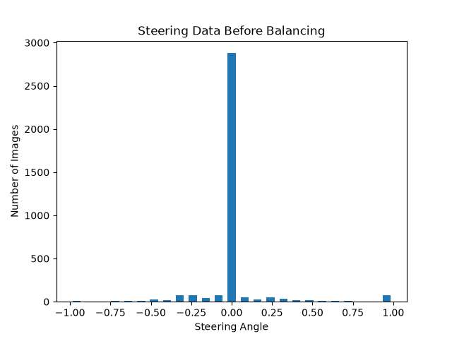
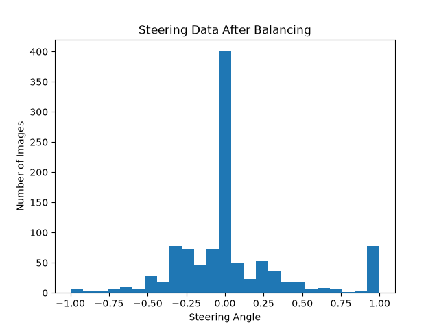
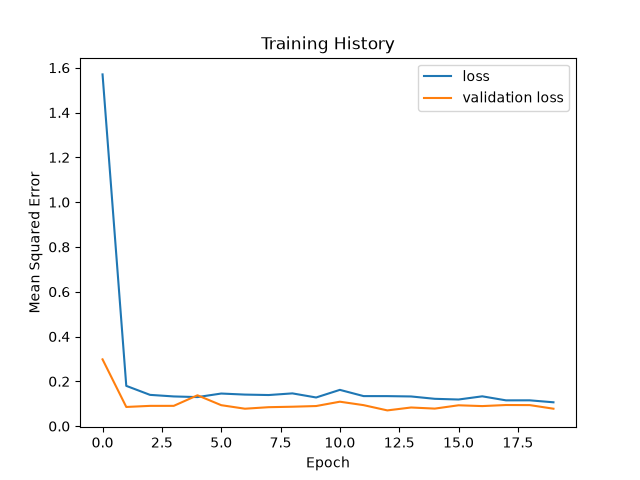

# Self-Driving Car Simulation Using a Convolutional Neural Network

## Project Overview

This project develops a convolutional neural network that predicts a vehicle's steering angle from images captured by the centre camera of the Udacity self-driving car simulator.

The model was trained using manually collected driving data and tested in autonomous mode. During autonomous testing, the trained model receives real-time camera images, preprocesses them, predicts steering values, and sends steering and throttle commands back to the simulator.

## Course Information

- **Course:** DPS920 – Computer Vision
- **Project:** Final Project
- **Instructor:** Ellie Azizi

## Team Members and Contributions

### MEMBER 1: RENATA

- Collected driving data using the simulator
- Reviewed and balanced the steering dataset
- Created steering-angle histograms
- Implemented image augmentation
- Implemented image preprocessing
- Implemented the training batch generator

### MEMBER 2: OLIVIA

- Implemented and reviewed the Nvidia CNN architecture
- Supported model training and validation
- Updated the simulator testing script for TensorFlow compatibility
- Reviewed the training and validation graphs
- Verified the trained model and project setup
- Completed the project documentation
- Supported final simulator testing and video preparation

## Repository Structure

```text
DPS920-Self-Driving-Car/
├── ModelTraining.py
├── TestSimulation.py
├── model.h5
├── requirements.txt
├── steering_before_balancing.png
├── steering_after_balancing.png
├── training_history.png
├── README.md
└── .gitignore
```

The raw simulator dataset is not stored in the repository because it contains a large number of image files.


```

## Dataset Collection

The training data was collected through the Udacity self-driving car simulator.

The car was driven manually around the track while recording:

- Centre-camera images
- Left-camera images
- Right-camera images
- Steering angles
- Throttle
- Brake values
- Speed

Only the centre-camera images and steering-angle values were used for this project.

A total of **3,528 recorded examples** were collected.

Driving data was collected in both directions to improve the variety and balance of the dataset.

## Dataset Balancing

The distribution of steering values was examined using a histogram.

Because manually collected driving data usually contains many straight-driving examples, bins containing too many examples were reduced. A maximum of 400 images was retained in each steering bin.

The following graphs show the distribution before and after balancing:

### Before balancing



### After balancing



## Data Augmentation

Random data augmentation was applied only to training images.

The following transformations were used:

- Horizontal panning
- Zooming
- Brightness adjustment
- Rotation
- Horizontal flipping

When an image was flipped horizontally, its steering value was multiplied by `-1`.

Steering values were also adjusted when panning or rotation changed the apparent road position.

## Image Preprocessing

Each image goes through the following preprocessing steps:

1. Crop the image to retain the road area
2. Convert the image from RGB to YUV
3. Apply a Gaussian blur
4. Resize the image to `200 × 66`
5. Normalize pixel values by dividing by 255

The processed model input shape is:

```text
66 × 200 × 3
```

## Nvidia CNN Architecture

The project uses a convolutional neural network based on Nvidia's behavioural-cloning architecture.

The network contains:

- Input layer: `66 × 200 × 3`
- Convolutional layer: 24 filters, `5 × 5`, stride 2
- Convolutional layer: 36 filters, `5 × 5`, stride 2
- Convolutional layer: 48 filters, `5 × 5`, stride 2
- Convolutional layer: 64 filters, `3 × 3`
- Convolutional layer: 64 filters, `3 × 3`
- Flatten layer
- Dense layer with 100 units
- Dense layer with 50 units
- Dense layer with 10 units
- Output layer with one steering-angle value

The convolutional and hidden dense layers use the ELU activation function.

The model was compiled with:

- Adam optimizer
- Mean squared error loss

## Training

The dataset was divided into:

- 80% training data
- 20% validation data

Training settings:

- **Epochs:** 20
- **Batch size:** 64
- **Final training loss:** 0.1065
- **Final validation loss:** 0.0779

To retrain the model, first place the simulator dataset inside the `data` folder and run:

```powershell
python ModelTraining.py
```

The script will:

1. Load `data/driving_log.csv`
2. Locate images inside `data/IMG`
3. Balance the steering data
4. Split the data into training and validation sets
5. Train the Nvidia CNN
6. Produce the training graphs
7. Save the trained model as `model.h5`

## Training Results



The training and validation losses decreased substantially during the first few epochs and remained relatively stable during later epochs.

The final trained model successfully completed an autonomous lap in the simulator.

## Environment Setup

### Windows PowerShell

Create a virtual environment:

```powershell
py -m venv .venv
```

Activate it:

```powershell
.\.venv\Scripts\Activate.ps1
```

Upgrade pip:

```powershell
python -m pip install --upgrade pip
```

Install the required packages:

```powershell
pip install -r requirements.txt
```

### macOS or Linux

Create a virtual environment:

```bash
python3 -m venv .venv
```

Activate it:

```bash
source .venv/bin/activate
```

Upgrade pip and install the dependencies:

```bash
python -m pip install --upgrade pip
pip install -r requirements.txt
```

## Autonomous Testing

Ensure that `model.h5` is in the same directory as `TestSimulation.py`.

Start the testing server:

```powershell
python TestSimulation.py
```

The program should display:

```text
Setting Up ...
```

It will then wait for the simulator to connect on port `4567`.

Next:

1. Open the Udacity self-driving car simulator
2. Select the same track used during data collection
3. Choose Autonomous Mode
4. Wait for the simulator to connect
5. Observe the vehicle following the road

Once connected, the terminal should display:

```text
Connected
```

It will also continuously print throttle, steering, and speed values.

## Challenges and Solutions

### Socket.IO compatibility

The simulator uses an older Socket.IO protocol. Compatible versions of `python-socketio` and `python-engineio` were included in `requirements.txt`.

### TensorFlow prediction compatibility

Newer TensorFlow/Keras versions return the model prediction as a nested array. The simulator script extracts the scalar steering value using:

```python
steering = float(model.predict(image, verbose=0)[0][0])
```

The `verbose=0` option also prevents prediction progress output from appearing for every simulator frame.

### Operating-system compatibility

Differences between Windows and macOS affected simulator availability, Python commands, package installation, and Socket.IO behaviour. Separate environment activation commands are therefore provided for Windows and macOS/Linux.

### Large dataset size

The raw driving images were not committed to GitHub because the dataset is large. The trained model, scripts, result graphs, and setup instructions are included so that the final model can still be tested.

## Final Result

The model was trained for 20 epochs and successfully completed an autonomous lap in the simulator.

The final demonstration video shows the trained model controlling the vehicle using real-time steering predictions.
